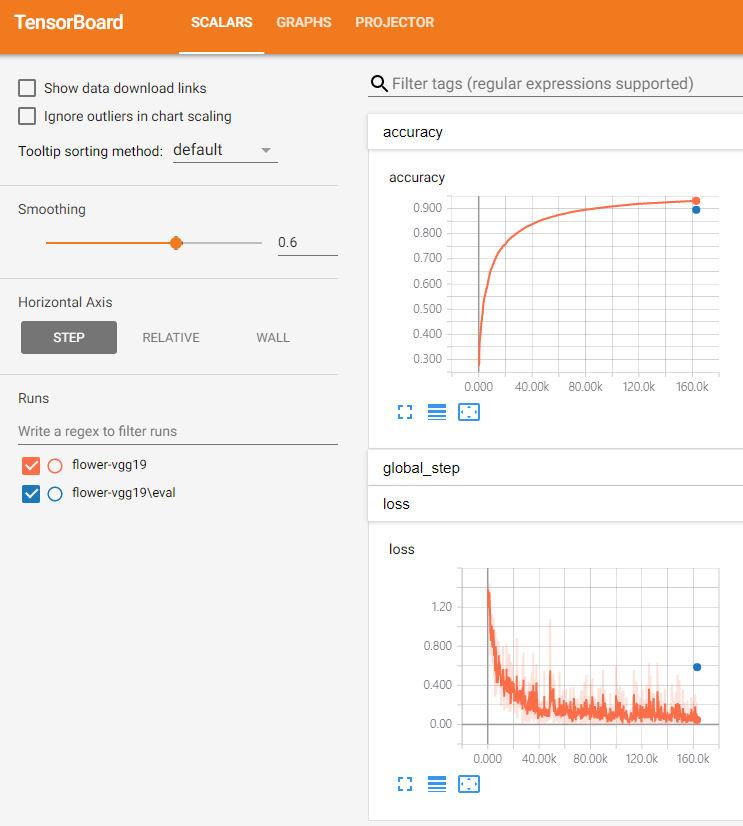

# tf-transfer-learning & fine tuning

## 1. tf.estimator + keras.application
* load pretrained weights from imagenet trained vgg19
* vgg19.py
* summary output

## 2. tf.estimator + tensorflow hub
* note: tensorflow >= 1.7
* load pretrained weights from imagenet trained inception_v3
* inception_v3.py
